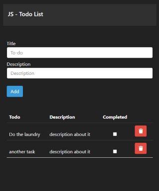
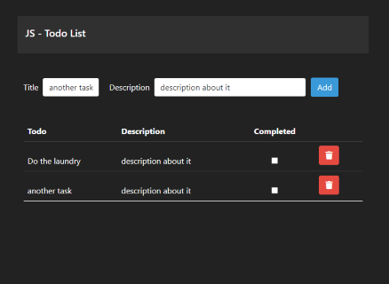

# To-Do list

To-Do list implemented in `JavaScript` and `Bootstrap`.

Tasks remain stored in the web browser, even if closing it completely.

# Screenshots

## Mobile



## Desktop Screen



# NPM instalation

```bash
# Dependency Installation
$ npm install

# Development environment
$ npm run dev   // folder: src

# Web for production
$ npm run build   // folder: dist
```